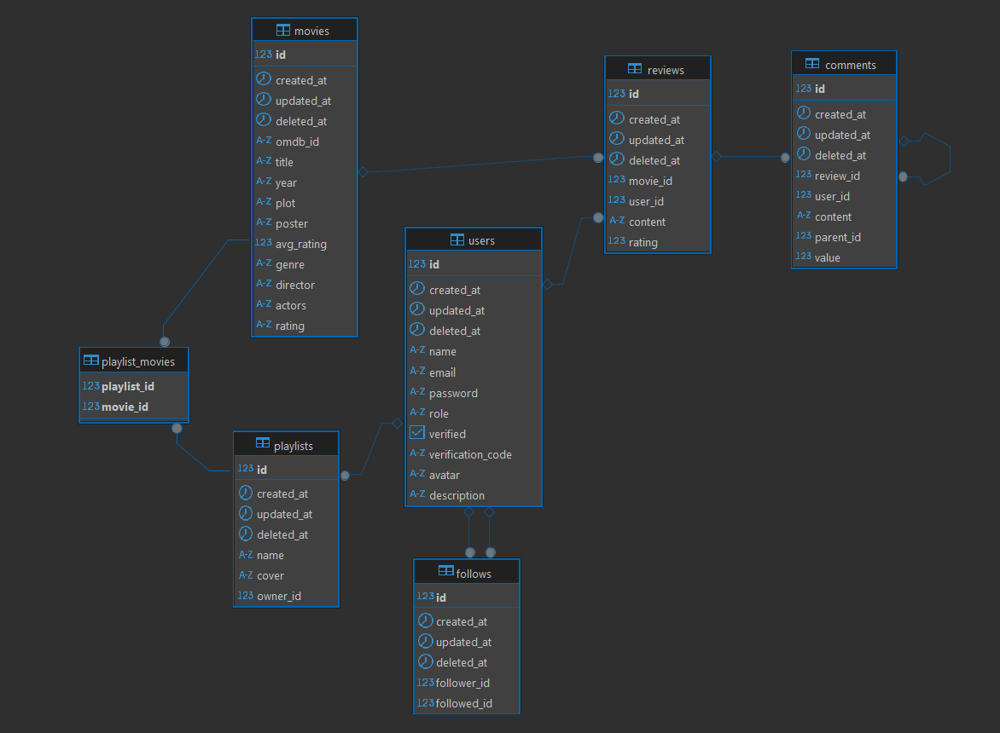

# totallyguysproject
put to cmd/server/.env ur local pg database address (DATABASE_URL)  
run app from cmd/server, (go run .)  
go to http://localhost:8080/swagger/index.html for swagger documentation

report 2/4:
# Movie Playlist Social App (Backend)

## 1. Project Description
This backend project is part of a web application that allows users to search for movies, create and manage playlists, leave reviews, participate in discussions, and interact socially around movies. Users can follow each other, comment on reviews, and build their own collections of favorite or watch-later movies. Admins have additional privileges to manage content across the platform.
**Movie data is fetched from the OMDb API**, which provides movie details such as title, year, poster, plot, and ratings.

## 2. Technology Stack
- **Programming Language:** Go  
- **Web Framework:** Gin  
- **ORM:** GORM  
- **Database:** PostgreSQL  

## 3. User Roles and Use Cases

### Roles
- **User:** Can search movies, create and manage personal playlists, write reviews, comment on others' reviews, follow other users, and engage socially.  
- **Admin:** All user capabilities, plus the ability to edit movie details, update descriptions, and delete reviews or comments made by any user.
  
## 4. Database Schema


## 5. API
The backend API endpoints are defined in the `server.go` file located in the `internal/server` directory.


# totallyweb
place this repo on the same level as totallyguysproject


## 6. Docker Compose — local development (example)
place file docker-compose.yml to root directory for both frontend and backend repos (one level higher)
```yaml
services:
  db:
    image: postgres:15
    environment:
      POSTGRES_DB: ${POSTGRES_DB}
      POSTGRES_USER: ${POSTGRES_USER}
      POSTGRES_PASSWORD: ${POSTGRES_PASSWORD}  
    ports:
      - "5432:5432"
    volumes:
      - pgdata:/var/lib/postgresql/data
    healthcheck:
      test: ["CMD", "pg_isready", "-U", "${POSTGRES_USER}", "-d", "${POSTGRES_DB}"]
      interval: 10s
      timeout: 5s
      retries: 5

  backend:
    build:
      context: ./totallyguysproject
      dockerfile: Dockerfile
    depends_on:
      db:
        condition: service_healthy
    environment:
      DATABASE_URL: postgres://${POSTGRES_USER}:${POSTGRES_PASSWORD}@db:5432/${POSTGRES_DB}?sslmode=${DB_SSLMODE:-disable}
      OMDB_API: ${OMDB_API}
      JWT_SECRET: ${JWT_SECRET}
    ports:
      - "8080:8080"

  frontend:
    build:
      context: ./totallyweb
      dockerfile: Dockerfile
    environment:
      API_URL: http://backend:8080/api
      WATCHPACK_POLLING: "true"
    ports:
      - "3000:3000"
    volumes:
      - ./totallyweb:/app 

volumes:
  pgdata:
```
<<<<<<< HEAD
Fill POSTGRES_USER, POSTGRES_DB, POSTGRES_PASSWORD, JWT_SECRET, OMDB_API with values for your machine.
=======
Fill POSTGRES_USER, POSTGRES_DB, POSTGRES_PASSWORD, JWT_SECRET, OMDB_API with values for your machine.
>>>>>>> 7b623be9abcf6a60a04c846604b2c9685ebaefae
